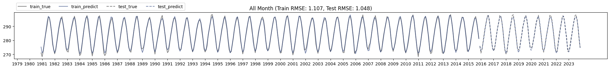
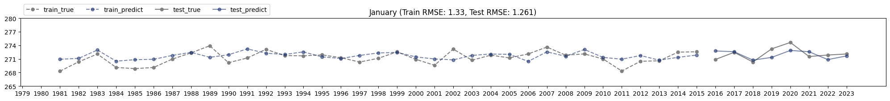
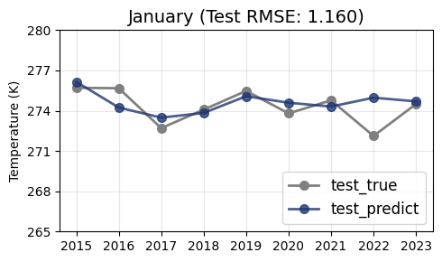
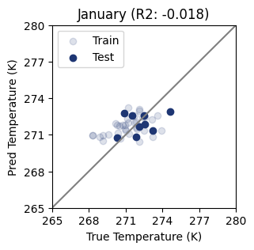
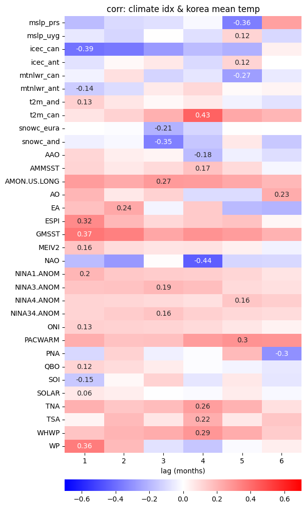
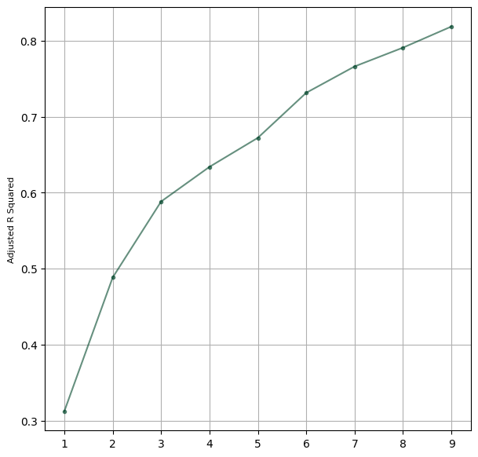
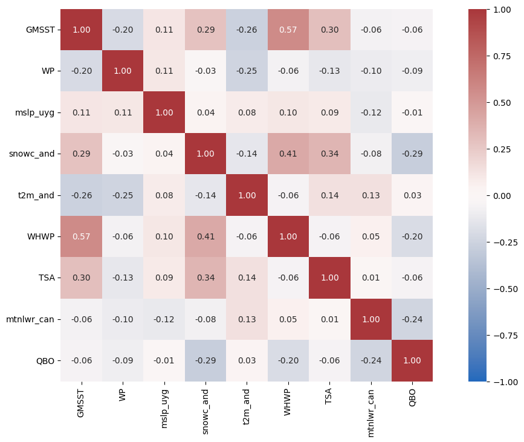

# GRU 기반 딥러닝 모델을 활용한 한반도 겨울철 기온 예측

[](https://www.python.org/)
[](https://www.tensorflow.org/)

**저자:** 김종민
**소속:** 서울대학교 지구환경과학부
**프로젝트 유형:** 학부 졸업논문

---

## 개요

한반도 1월 평균기온 예측은 **에너지 공급 관리** 및 **재난 대응**에 매우 중요합니다. 기존의 통계적·물리적 예측 방법은 극한 한파와 기온 이상 현상을 포착하는 데 한계가 있습니다.

본 프로젝트는 **GRU (Gated Recurrent Unit)** 딥러닝을 적용하여, 전 지구 기후 지수와 한반도 겨울 기온 간의 비선형 관계를 학습함으로써 예측 정확도를 향상시키고자 합니다.

### 주요 특징

- **45년간**의 전 지구 기후 데이터 처리 (1979-2023)
- **NOAA 기후 지수 23종** + **ERA5 재분석 변수 5종** 통합
- 전체 월 예측 **RMSE ≈ 1K** 달성
- 시간 지연(time-lag)을 고려한 **단계적 변수 선택(stepwise feature selection)** 적용

---

## 결과

### 모델 성능

| 지표 | 전체 월 | 1월만 |
|------|---------|-------|
| **훈련 RMSE** | 1.01 K | 1.41 K |
| **테스트 RMSE** | 1.19 K | 1.35 K |
| **테스트 R²** | 0.98 | -0.61 |

> **참고:** 1월 R² < 0은 모델이 극한 현상을 포착하는 데 어려움이 있음을 나타냅니다. 이는 추가 변수 도입이나 고급 아키텍처를 통해 개선할 여지가 있음을 시사합니다.

### 예측 결과

#### 전체 월 (1979-2023)

*모델이 RMSE ≈ 1K로 계절 기온 주기를 성공적으로 포착*

#### 1월 예측

*1월 예측은 겨울철 극한 기온 예보의 어려움을 보여줌*

#### 1월 테스트 기간 (2015-2023)


#### 산점도 - 1월

*1월 예측값 vs 관측값 산점도*

---

## 방법론

### 1. 데이터 수집

| 출처 | 변수 | 해상도 |
|------|------|--------|
| **NOAA PSL** | 기후 지수 23종 (AO, NAO, ENSO, QBO, PDO 등) | 월별 |
| **ERA5 재분석** | 해면기압, 해빙, OLR, 2m 기온, 적설 면적 | 2.5° × 2.5° |

### 2. 특성 공학

**시간 지연을 고려한 상관분석:**
각 기후 변수와 한반도 평균기온 간의 상관관계를 1~6개월 지연을 고려하여 계산하였습니다.


*기후 지수와 한반도 1월 기온 간 시간 지연별 상관계수*

### 3. 변수 선택

**단계적 회귀(Stepwise Regression):**
수정 R²를 최대화하면서 다중공선성을 최소화하는 최적 입력 변수를 선택하였습니다.


*단계적 변수 선택 과정에서의 수정 R² 변화*

**최종 선택 변수:**
| 변수 | 설명 | 최적 지연 |
|------|------|-----------|
| WP | 서태평양 패턴 | 6개월 |
| WHWP | 서반구 온수 풀 | 6개월 |
| TSA | 열대 남대서양 지수 | 6개월 |
| QBO | 준2년 진동 | 6개월 |
| SNOWC_EURA | 유라시아 적설 면적 | 6개월 |


*최종 선택 변수들의 상관관계 행렬*

### 4. 모델 구조

**GRU (Gated Recurrent Unit)**를 LSTM 대신 선택한 이유:
- 파라미터 수 감소 → 빠른 학습
- 본 데이터셋에서 유사한 성능
- 제한된 학습 샘플(36년)에 더 적합

```
모델: Sequential
─────────────────────────────────────────────
레이어 (타입)              출력 형태        파라미터 수
═════════════════════════════════════════════
GRU (return_seq=True)     (None, 1, 256)  199,680
Dropout (0.2)             (None, 1, 256)  0
GRU (return_seq=True)     (None, 1, 256)  394,752
Dropout (0.2)             (None, 1, 256)  0
GRU (return_seq=True)     (None, 1, 256)  394,752
Dropout (0.2)             (None, 1, 256)  0
GRU (return_seq=True)     (None, 1, 256)  394,752
Dropout (0.2)             (None, 1, 256)  0
GRU (return_seq=False)    (None, 256)     394,752
Dropout (0.2)             (None, 256)     0
Dense                     (None, 1)       257
═════════════════════════════════════════════
총 파라미터: 1,778,945
─────────────────────────────────────────────
```

**하이퍼파라미터 튜닝:**
5-fold 교차검증을 통한 최적 구성 탐색:
- 레이어 수: GRU 6층
- 뉴런 수: 층당 256개
- 배치 크기: 64
- 드롭아웃: 0.2
- 조기 종료: patience=15

---

## 프로젝트 구조

```
WCDL/
├── notebooks/
│   ├── 01_Data_Collection.ipynb      # ERA5 & NOAA 데이터 다운로드
│   ├── 02_Data_Preprocessing.ipynb   # 특성 공학 & 상관분석
│   └── 03_Modeling.ipynb             # GRU 학습 & 평가
│
├── data/
│   ├── raw/
│   │   ├── era5/                     # ERA5 재분석 데이터 (.nc)
│   │   └── noaa_indices/             # 기후 지수 (.data)
│   ├── interim/                      # 중간 처리 파일
│   └── processed/                    # 모델 입력용 데이터
│
├── outputs/                          # 결과 시각화
│   ├── correlation_heatmap_lag.png
│   ├── stepwise_selection.png
│   ├── prediction_all_months.png
│   ├── prediction_january.png
│   └── ...
│
└── README.md
```

---

## 기술 스택

| 분류 | 기술 |
|------|------|
| **언어** | Python 3.11 |
| **딥러닝** | TensorFlow, Keras (GRU, Dense, Dropout) |
| **데이터 처리** | pandas, numpy, xarray, netCDF4 |
| **시각화** | matplotlib, seaborn, Cartopy |
| **ML 유틸리티** | scikit-learn (MinMaxScaler, KFold, metrics) |
| **통계** | statsmodels (단계적 회귀, VIF) |
| **데이터 출처** | CDS API (ERA5), NOAA PSL |

---

## 시작하기

### 사전 요구사항

```bash
pip install tensorflow pandas numpy xarray netCDF4 matplotlib seaborn cartopy scikit-learn statsmodels cdsapi
```

### 노트북 실행

1. **데이터 수집** - 기후 데이터 다운로드 (CDS API 키 필요)
   ```bash
   jupyter notebook notebooks/01_Data_Collection.ipynb
   ```

2. **전처리** - 특성 공학 및 상관분석
   ```bash
   jupyter notebook notebooks/02_Data_Preprocessing.ipynb
   ```

3. **모델링** - GRU 모델 학습 및 평가
   ```bash
   jupyter notebook notebooks/03_Modeling.ipynb
   ```

---

## 향후 개선 사항

- [ ] 재분석 변수 추가 (지위고도, SST 패턴 등)
- [ ] 어텐션 메커니즘 실험
- [ ] 다중 모델 앙상블 기법 구현
- [ ] 예측 대상을 다른 겨울철 월(12월, 2월)로 확장

---

## 참고 문헌

- 한빛나라, 임유나, 김현경, 손석우 (2018). "한반도 겨울철 기온의 월별 통계적 예측 모형." *대기*, 28(2), 153-162. DOI: 10.14191/Atmos.2018.28.2.153

---

## 연락처

**김종민** - 서울대학교
- GitHub: [@kevin7548](https://github.com/kevin7548)
- Email: jongmin.kim.k@gmail.com
